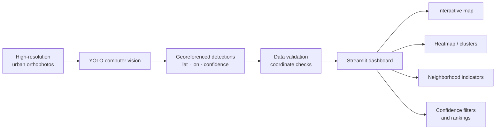

# Urban Waste Detection Dashboard — Goiânia

Interactive **GeoAI decision-support dashboard** for exploring georeferenced urban-waste detections produced by a YOLO computer-vision workflow applied to high-resolution orthophotos of Goiânia, Goiás, Brazil.

**Methodological and computational development:** Prof. Hugo José Ribeiro  
**Application domain:** urban environmental monitoring and municipal decision support

> This public repository contains the visualization and spatial-analysis layer of the workflow. The dashboard consumes a georeferenced detection table generated upstream by the computer-vision pipeline; training datasets, model weights and other large/intermediate assets are not distributed here.

## Overview



## Main capabilities

The dashboard provides:

- interactive geospatial visualization of detected urban-waste points;
- marker clusters for dense detection sets;
- heatmap visualization of spatial concentration;
- automatic sanity checking and correction of inverted latitude/longitude fields;
- filtering by YOLO confidence threshold;
- filtering by neighborhood;
- municipal summary indicators;
- Top-5 neighborhoods by number of detections;
- mean detection confidence by neighborhood;
- table of highest-confidence detections;
- selectable CartoDB, OpenStreetMap, Google Streets and Esri satellite basemaps;
- caching and point sampling to improve performance with large detection tables.

## Scientific and applied relevance

The application illustrates a reproducible path from **computer vision to geospatial decision support**:

```text
urban imagery
    ↓
object detection
    ↓
georeferenced observations
    ↓
spatial visualization and aggregation
    ↓
territorial prioritization
    ↓
municipal environmental management
```

The dashboard is intended as a demonstrator for the use of GeoAI in urban environmental monitoring. It can support inspection, prioritization and exploratory assessment of spatial concentrations of detected waste.

## Repository structure

```text
dashboard-lixo-gyn/
├── streamlit_app.py
├── requirements.txt
├── README.md
├── LICENSE
├── CITATION.cff
├── VERSION
├── .gitignore
└── data/
    └── DETECCOES_LATLON4.csv   # user-supplied / generated upstream
```

The `data/` directory is intentionally excluded from version control.

## Input data

The dashboard expects:

```text
data/DETECCOES_LATLON4.csv
```

Required columns:

| Column | Description |
|---|---|
| `lat` | Latitude of the detection |
| `lon` | Longitude of the detection |
| `conf` | YOLO detection confidence |

Optional columns:

| Column | Description |
|---|---|
| `bairro` | Neighborhood associated with the detection |
| `class` | Detection class; used for optional visual differentiation |

If `bairro` is absent, the dashboard labels the record as `Não identificado`.

The application also checks coordinate plausibility for the Goiás region and automatically detects a common latitude/longitude inversion.

## Installation

Clone the repository:

```bash
git clone https://github.com/hgribeirogeo/dashboard-lixo-gyn.git
cd dashboard-lixo-gyn
```

Create and activate a Python environment, then install the dependencies:

```bash
pip install -r requirements.txt
```

Place the georeferenced detection CSV in:

```text
data/DETECCOES_LATLON4.csv
```

Run the dashboard:

```bash
streamlit run streamlit_app.py
```

The application can also be deployed through Streamlit Community Cloud after configuring the required input data.

## Technologies

`Python` · `Streamlit` · `Pandas` · `NumPy` · `Folium` · `Plotly` · `YOLO` · `GeoAI` · `Computer Vision` · `Spatial Analysis`

## Scope and reproducibility

This repository exposes the dashboard and its spatial-processing logic as open-source research software.

The YOLO training dataset, trained model weights and image-processing assets are separate components of the broader workflow and are not required to inspect the dashboard source code. Users who wish to reproduce the interface can provide any compatible georeferenced detection table following the documented schema.

## License and citation

This software is released under the **MIT License**. See [`LICENSE`](LICENSE).

**Public release:** `v1.0.0`

For academic citation and software authorship metadata, see [`CITATION.cff`](CITATION.cff).

> Third-party imagery, basemap tiles and external datasets remain subject to the licenses and terms of their respective providers.
